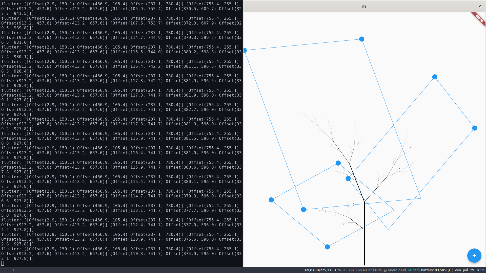

# Iterated Function System Drawing App

## Features
- [x] Drag & Drop with GestureDetector
- [x] Draw fractals with CustomPainter
- [ ] The initial image (to derive the fractal from) could be an uploading picture

## Run
First you have to clone the repo, and then follow [these instructions](https://github.com/Tensegritics/ClojureDart/blob/main/doc/quick-start.md) from the official documentation of ClojureDart.
> :bulb: make sure to have both Clojure, Flutter, and Android-SDK installed.

:flower: Feel free to fork, contribute, and add some issues!
